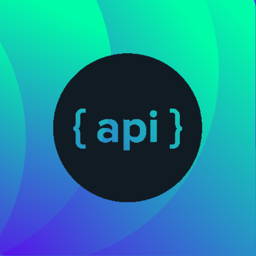

    
    <h2>Cekongkir</h2>
    

        V1.0.0
        Free
        Android
        Flutter
    

    
Mobile application for cheking the cost of shipping goods in Indonesia.

    
<a href="/apps/cekongkir">Read More </a>

    
<i>Released on March 3, 2023</i>

Application I have built

    <ul style="list-style:none;margin-left:0;margin-top:0;margin-bottom:0;">
        <li>
            
            <a href="https://github.com/gusrylmubarok/backing-platform-backend/" style="list-style:none;margin-left:0;margin-top:0;margin-bottom:0;" target="_blank">
                Backing Platform API <i>on Feb 15, 2023</i> | 
                Go, Gin-Gonic, MySQL
            </a>
        </li>
        <li>
            
            <a href="http://toeflclass-mzssoftwarehouse.com/" style="list-style:none;margin-left:0;margin-top:0;margin-bottom:0;" target="_blank">
                MZS CBT Website <i>on Nov 5, 2020</i> | 
                PHP, CSS, CodeIgneter, Bootstrap
            </a>
        </li>
        <li>
            
            <a href="https://github.com/gusrylmubarok/reddot/" style="list-style:none;margin-left:0;margin-top:0;margin-bottom:0;" target="_blank">
                Reddot API <i>on Jul 1, 2020</i> | 
                Kotlin, Spring Boot, Postgres
            </a>
        </li>
        <li>
            
            <a href="https://fosmotor.com/" style="list-style:none;margin-left:0;margin-top:0;margin-bottom:0;" target="_blank">
                FOSMotor Website <i>on Jan 30, 2020</i> | 
                PHP, CSS, Laravel, Bootstrap
            </a>
        </li>
    </ul>

